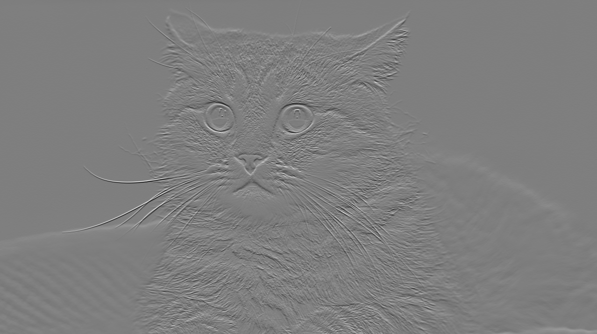
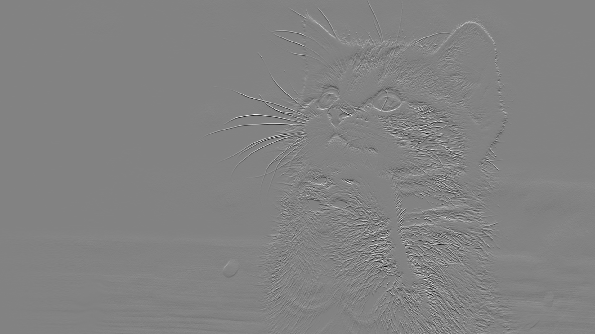
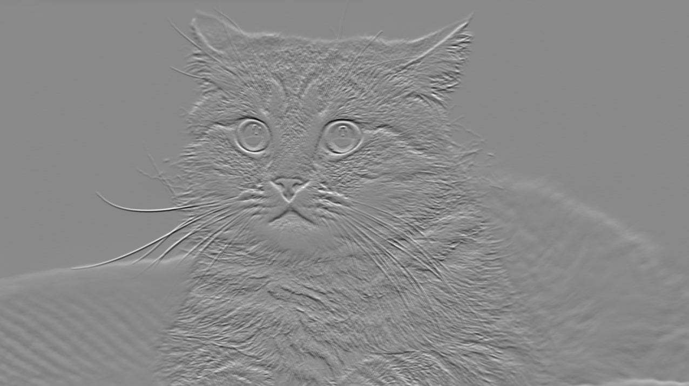
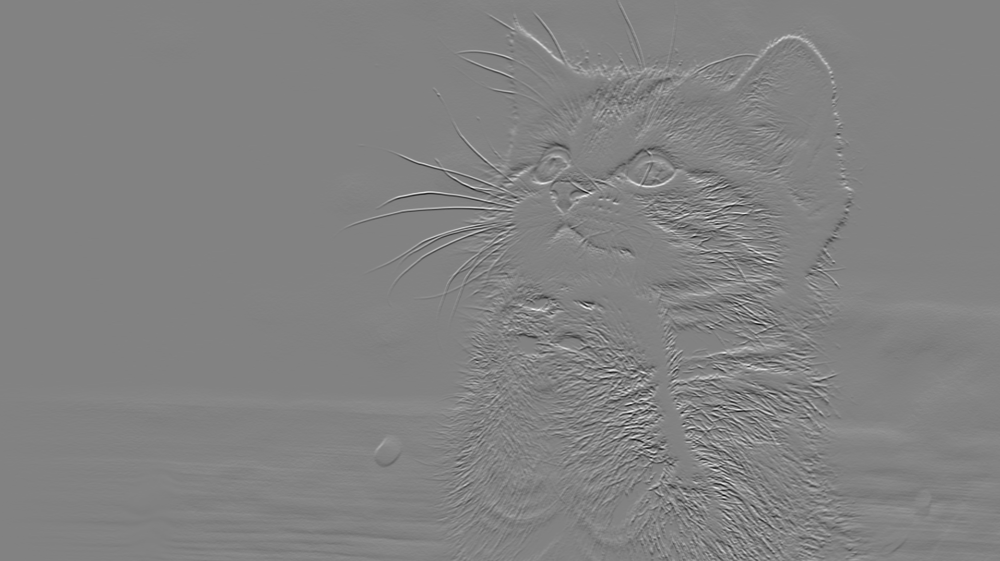
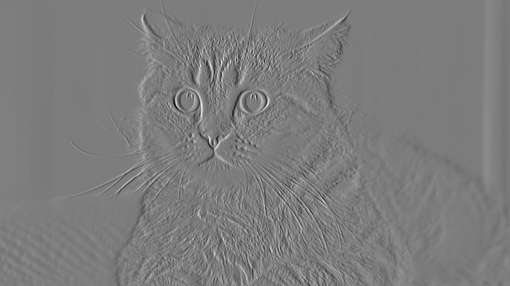
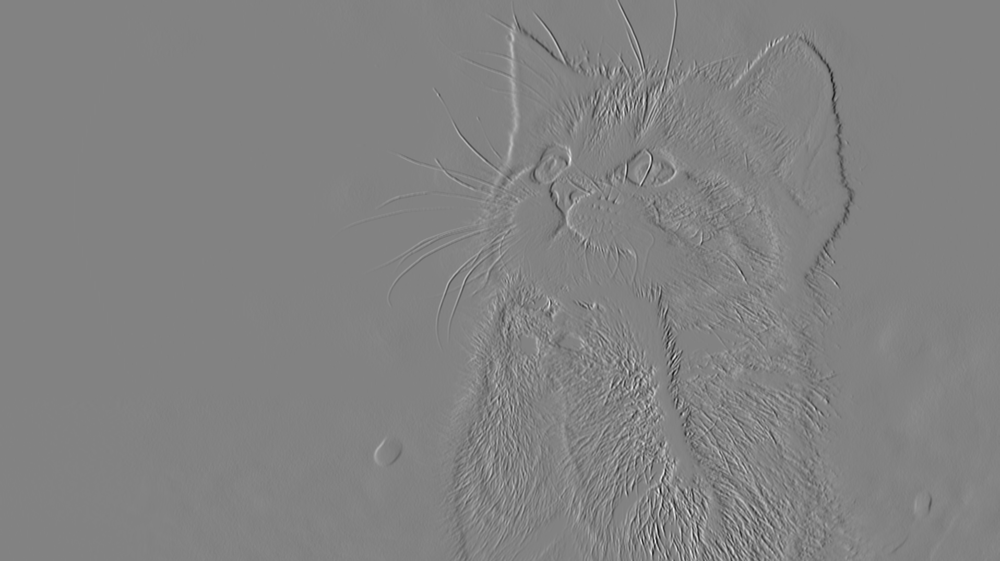
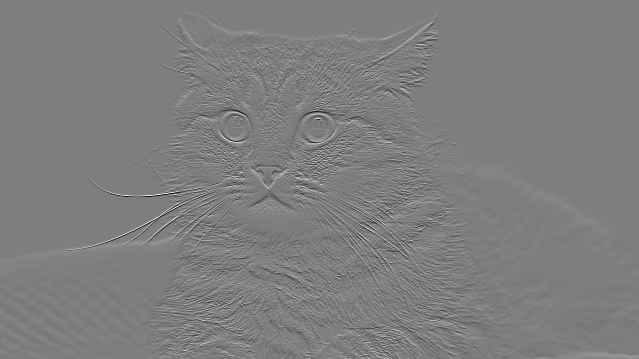
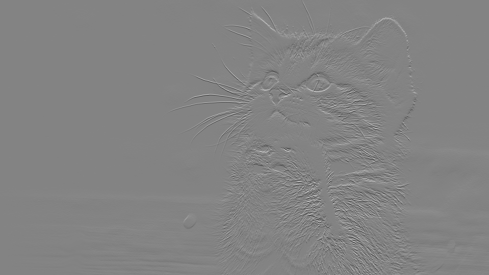
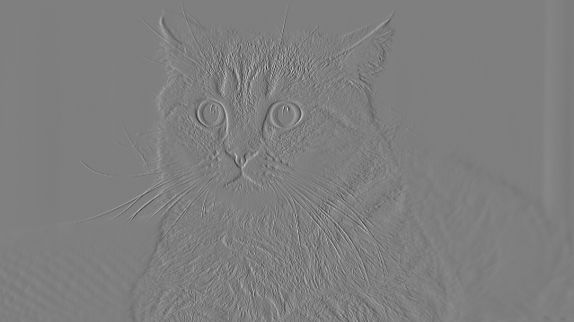
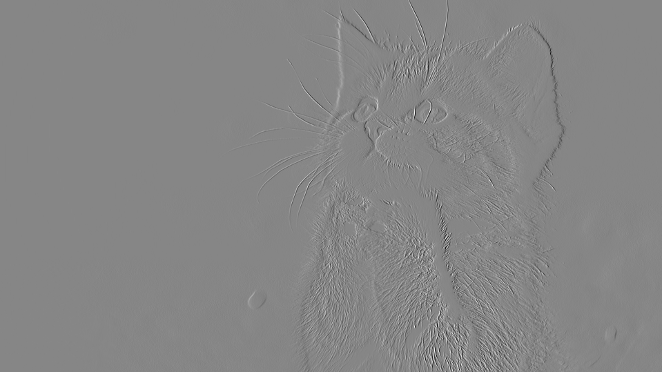

# BME595HW
BME595A Homework Fall 2017

### Part A
The result image are shown for each tasks as bellow.
#### Task1
###### 720p:

###### 1080p:

#### Task2
##### k4
###### 720p:

###### 1080p:

##### k5
###### 720p:

###### 1080p:

#### Task3
##### k1
###### 720p

###### 1080p

##### k2
###### 720p

###### 1080p

##### k3
###### 720p

###### 1080p

### Part B
The duration is plotted against i for both 720p and 1080p image. The operation duration is porportional to the number of channel of the output image/tensor.

### Part C:
The number of operations are plotted against the kernel size for both 720p and 1080p image.

### Part D:
The duration is plotted against i for both 720p and 1080p image. The operation durations are orders of magnitudes smaller than python implimentation. For loop in python should be replaced by vectorized operations.

