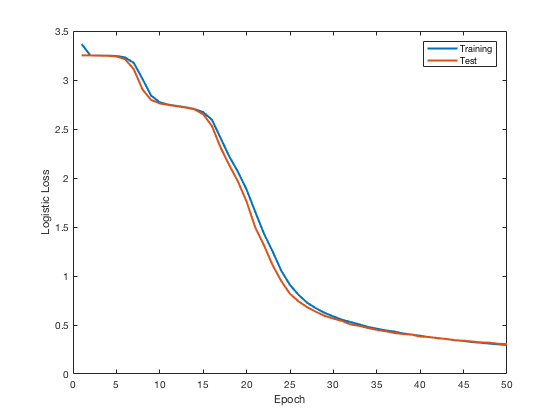
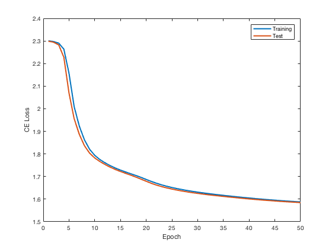

# BME595A Homework 4 Fall 2017
## Fan Fei

### Summary
In my_img2num.py, the network is initialized using NerualNetwork. The network size is [784,200,50,10]. The train() function use a learning rate of 1, batch size of 1000 and will run 50 epochs. The data set will be reshaped into 786 x m, where m is the batch size. The target is constructed using one hot encoding. The data is trained and the training and test error is evaluated every epoch.
The forward function will output a number from 0 to 9 corresponding to the predicted class.

In nn_image2num.py, the network has the same size of [784,200,50,10], the same batch size of 1000 and 50 epochs. The network using sigmoid activation and a softmax at output. Cross entropy loss is used. The training and test error is evaluated every epoch.

### Results

Running test.py, two networks are called and trained, the duration and errors are printed out.

The training time using MyImg2Num is 354.57s, the training time using NnImage2Num is 449.82s.

The training and test error of MyImg2Num is plotted as below

The training and test error of NnImg2Num is plotted as below

