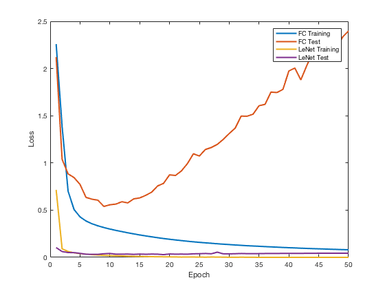

# BME595A Homework 4 Fall 2017
## Fan Fei

### Part A
In img2num.py, the network is initialized using torch.nn. The network architecture follow LeNet. The fully connected networ in nn_img2num is still [784,200,50,10] as in Homework 4. Both network are trained using learning rate of 0.1, batch size of 100 and trained for 50 epochs.

The result tranning error and classification accuracy are plotted as below.

LeNet converges much faster than the fully connect network, however it take longer to train. For 50 epochs of training, fully connect network uses 550 seconds, LeNet uses 1636 seconds. The inference time for fully connect network is 50 seconds while for LeNet is 139 seconds.

Both networks started to over fit after approximatly 10 epochs, where training error keeps on decreasing and test error increases. For LeNet, the test accuracy remained above 99%, while the best test accuracy for the fully connected network is only 83% at epoch 9.

### Part B

In img2obj.py, the network and training and test set is initiated and loaded in the __init__ function. The network architechture follow LeNet with increased numbers of kernels. Specifically the first convolution layer uses 64 kernels, the second convolution layer uses 128 kernels and the third convolution layer uses 512 kernels resulting an m x 512 x 1 x 1 output with two subsequent fully connected layer of size 256 and 100.

The model was trained for 10 epoch achieved an accuracy of 41%.

The model is trained in test.py and saved in model.pth file. The model can be reused in test.py by torch.load() the file for video live captioning and external image viewing. To retrain the model, uncomment line LN = img2obj() and LN.train() int test.py.

The train() function use learning rate of 0.025 with batch size of 50 and momuntum of 0.5. The network is trained for 10 epochs to prevent over fitting.

The view() function takes an external image and displays it. The prediction class label is printed out. The image is read using opencv, where it was converted to RGB first then cropped and resized to 32 x 32.

The cam() function takes the camera index and continuously displays the class label on the video window. The full sized image is displayed with prediction and the resized (32 x 32) image is used for prediction. Some correct examples are shown below.

  
